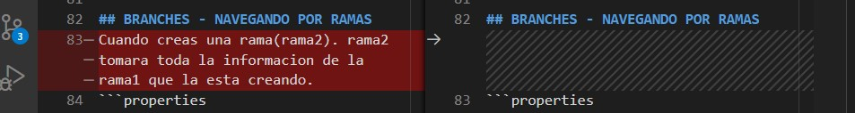

# GIT
## CONOCIENDO EL FLUJO DE GIT

* EL PROYECTO INICIA CON EL WORKING DIRECTORY, QUE ES EL DIRECTORIO PRINCIPAL QUE RECIBIRA TODOS LOS CAMBIOS. EN ESTE MOMENTO ESTAMOS CON UN **GIT STATUS** ROJO
* PASAMOS AL STAGED AREA , AL USAR **GIT ADD** . , en este punto guardamos en memoria cambios que aun podemos revertir con **GIT RESTORE**
* PASAMOS AL AREA DE COMMITED AL USAR **GIT COMMIT -M " text"**
Y FINALMENTE PASAMOS TODOS NUESTROS ARCHIVOS AL REMOTO, "LA NUBE DE GITHUB" AL USAR **GIT PUSH**.


## CONFIGURANDO GIT
```properties
#AL INICIAR GIT TENEMOS QUE CONFIGURAR ALGUNAS PROPIEDADES

#la clave --global hace referencia a que este cambio sera en abmito global para todo el S.O.
git config --global user.name "Abel Abed"
git config --global user.email abel_silva27@hotmail.com
git config --global user.ui true
#para ver la lista de configuraciones
git config --list
# ver todas las opciones de la configuración en la terminal
git config -h
# ver todas las opciones de la configuración en el navegador
git help config  

```

## FLUJO
```bash
#PARA INICIAR UN REPOSITORIO WORKING DIRECTORY
git init

#PARA AGREGAR LOS CAMBIOS AL STAGED
git add archivo/directorio
git add .

#CREAR UN ID/ TENER UN HISTORIAL DE LOS CAMBIOS
git commit
git commit -m
#PARA SALIR DEL EDITOR DE COMMIT ESCRIBIR
:wq 

#OPCIONALMENTE PODEMOS SELECCIONAR LA RAMA DONDE GUARDAR LOS CAMBIOS
git branch -M main

#PARA HACER REFERENCIA AL ORIGEN REMOTO
git remote add origin http://github.com/user/repositorio.git

#PARA SUBIR LOS CAMBIOS AL REPOSITORIO DE GITHUB X PRIMERA VEZ
#-u = --set-upstream que significa, crea la rama en el remoto....
git push -u origin master

#PARA NUEVAS ACTUALIZACIONES
git push


#PARA DESCARGAR CAMBIOS
git pull 
```
## FLUJO LUEGO DE HACER EL PRIMER PUSH
```properties
#vemos la fase del flujo
git status
#pasamos a staged
git add .
#pasamos al commit
git commit -m "mensaje commit"
#pasamos al remote
git push
```

## GIT IGNORE
Es un archivo donde se le indica que carpetas o directorios no debe hacer seguimiento.
```properties
#Ignorar archivos,carpetas
archivo.etc
carpeta
/carpeta/archivo.etc
#ignorar en conjunto
*.etc
#ignorar excepto
!archivo.etc
#ingorar por carpeta
carpeta/*.txt
#ignorar por carpteas
carpeta/**/*.txt
```

## CLONAR REPOSITORIOS
Si queremos obtener un proyecto ya aloja en git podemos usar `git clone`.
```
git clone https://github.com/user/proyecto.git
```

## BRANCHES - NAVEGANDO POR RAMAS
Cuando creas una rama(rama2). rama2 tomara toda la informacion de la rama1 que la esta creando.
```properties
#crear rama
git branch nombre_rama

#navegar por ramas
git checkout nombre_rama

#crear rama y navegar por ella
git -b checkout nombre_rama

#eliminar rama
git branch -d nombre_rama

#eliminar ramas remotas
git push origin --delete nombre_rama

#eliminar rama (forzado)
git branch -D nombre_rama

#listar las ramas del repositorio
git branch

# lista ramas no fusionadas a la rama actual
git branch --no-merged

# lista ramas fusionadas a la rama actual
git branch --merged

# rebasar ramas
git checkout rama-secundaria
git rebase rama-principal

#guardar en el remoto una rama
git push -u origin nombre_rama
git push --set-upstream origin nombre_rama

#eliminar rama del remote
git push origin --delete nombre_rama
```

## FUSIONES
Para fusionar debemos situarnos en la rama que recopilara la data de las otras ramas, Esta rama debe estar en el area de commit.<br>
Tambien hay que tener en cuenta que pueden surgir conflictos debido al editar un mismo archivo y los mismos fragmentos de codigo.
### FAST FORWARD: LA fusion se hace sin conflictos
### MANUAL MERGE: Fusion manual debido a edicion del mismo codigo

```properties
#Nos dirigimos a la rama que recopilara la informacion
git checkout rama_principal
#Hacemos la fusion
git merge rama_secundaria
#Para salir del editor de codigo escribir :wq, este editor crea un commit al hacer el merge
:wq
```
En nuestro merge ocurrio un MANUAL MERGE debido a que el archivo README de la rama principal fue editado y el README de la rama habia echo una copia antes que esta edicion fuera creada.<br>
Ante esto tenemos 3 opciones y 1 opcion visuable.
* Accept current Change: Aceptamos los cambios de la rama_principal
* Accept Incomming Change: Aceptamos los cambios de la rama_secundaria
* Accept Both Change: Aceptamos ambos cambios
* Compare Change: Opcion visuable para comparar los cambios.
<hr>


<hr>


## CAMBIOS EN EL COMMIT
Puedes agregar modificaciones al último cambio

```properties
# Guardar edicion en el último commit
git commit --amend --no-edit

# editando el mensaje del último commit
git commit --amend -m "nuevo mensaje para el último commit"

# eliminar el último commit
git reset --hard HEAD~1
```

## VIAJAR ENTRE COMMITS
Podemos desplazarnos en el historial del repositorio hacia atrás o adelante en cambios o ramas , sin afectar el repositorio como tal.
Previamente debemos estar en fase commit
```properties
# cambiar a una rama
git checkout nombre-rama

# cambiar a un commit en particular
git checkout id-commit
```
## REGISTRO DE HISTORIAL
```properties
git log

# muestra en una sola línea por cambio
git log --oneline

# guarda el log en la ruta y archivo que especifiquemos
git log > commits.txt

# muestra el historial con el formato que indicamos
git log --pretty=format:"%h - %an, %ar : %s"

# cambiamos la n por cualquier número entero y mostrará los n cambios recientes
git log -n

# muestra los cambios realizados después de la fecha especificada
git log --after="2019-07-07 00:00:00"

# muestra los cambios realizados antes de la fecha especificada
git log --before="2019-07-08 00:00:00"

# muestra los cambios realizados en el rango de fecha especificado
git log --after="2019-07-07 00:00:00" --before="2019-07-08 00:00:00"

# muestra una gráfica del historial de cambios, rama y fusiones
git log --oneline --graph --all

# muestra todo el registro de acciones del log
# incluyendo inserciones, cambios, eliminaciones, fusiones, etc.
git reflog

# diferencias entre el Working Directory y el Staging Area
git diff
```

## RESETEO DE HISTORIAL
```properties
#nos muestra el listado de archivos nuevos (untracked), borrados o editados
git status

#borra cambios en el working
git restore .

#borra cambios en el stage (quita el add)
git restore --stage .

# borra HEAD
git reset --soft

# borra HEAD y Staging (similar al git restore --stage) quita el add.
git reset --mixed

# borra todo: HEAD, Staging y Working Directory (quita quita el add . y la data luego del ultimo commit)
git reset --hard

# deshace todos los cambios después del commit indicado, preservando los cambios localmente (elimina los commits y los add. pero no elimina la data en el working directory)
git reset id-commit

# desecha todo el historial y regresa al commit especificado (elimina todo incluido la data en el working directory)
git reset --hard id-commit
```

## REMOTOS

```properties
# muestra los orígenes remotos del repositorio
git remote

# muestra los orígenes remotos con detalle
git remote -v

# agregar un orígen remoto
git remote add nombre-orígen https://github.com/usuario/repositorio.git

# renombrar un orígen remoto
git remote rename nombre-viejo nombre-nuevo

# eliminar un orígen remoto
git remote remove nombre-orígen

# descargar una rama remota a local diferente a la principal
git checkout --track -b rama-remota origin/rama-remota

```
## TAG
```properties
# listar etiquetas
git tag

# crea una etiqueta, esta etiqueta se agrega automaticamente al ultimo commit
git tag numero-versión

# eliminar una etiqueta
git tag -d numero-versión

# mostrar información de una etiqueta y todos los commits dentro
git show numero-versión

#Subiendo etiqueta al repositorio remoto,considerando que no hay mas cambios
git tag v1.0.0
git push origin numero-version

# sincronizando la etiqueta del repositorio local al remoto, si hay mas cambios
git add .
git  tag v1.0.0
git commit -m "v1.0.0"
git push origin numero-versión

# generando una etiqueta anotada (con mensaje de commit)
git add .
git tag -a "v1.0.0" -m "Mensaje de la etiqueta"
git push --tags

```

## GITHUB PAGES
<div style="text-align:center"><a style="display:inline-block;border:1px solid #ccc;padding:7px 14px;border-radius:5px;color:green;font-weight:bold" href="https://abelssc.github.io/GIT/">GITHUB PAGE</a><div>

